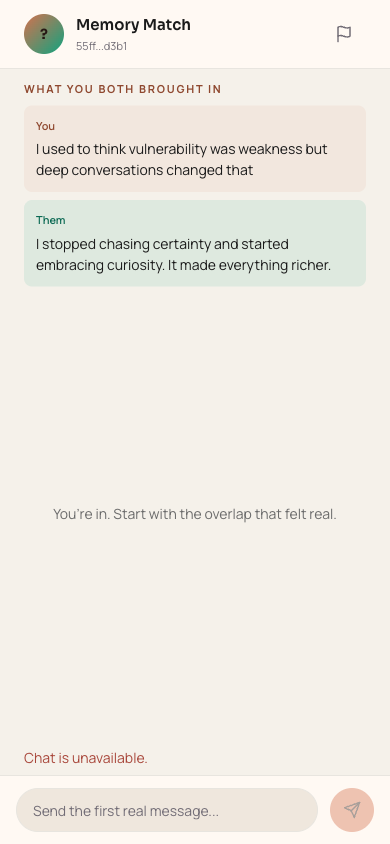
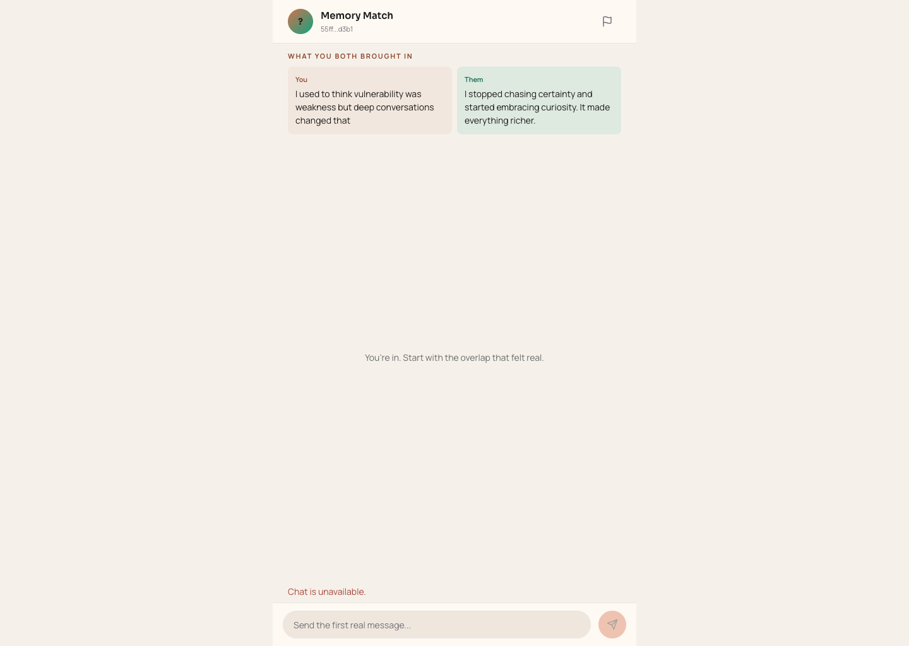
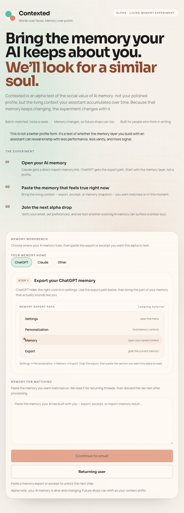
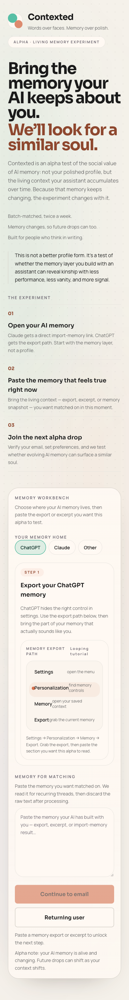

# Dogfood Report: Contexted web app

| Field | Value |
|-------|-------|
| **Date** | 2026-03-08 |
| **App URL** | `http://127.0.0.1:5180` |
| **Session** | `contexted-local` |
| **Scope** | Full app UX review with responsiveness focus |

## Summary

| Severity | Count |
|----------|-------|
| Critical | 0 |
| High | 0 |
| Medium | 3 |
| Low | 0 |
| **Total** | **3** |

## Issues

### ISSUE-001: Chat route keeps polling after the conversation has already closed

| Field | Value |
|-------|-------|
| **Severity** | medium |
| **Category** | performance / ux / console |
| **URL** | `http://127.0.0.1:5180/app/chat` |
| **Repro Video** | N/A |

**Description**

When a signed-in user lands directly on `/app/chat` after the match window has expired, the page renders a disabled composer, shows “Chat is unavailable,” and repeatedly hits `/v1/matches/:id/messages`. The result is a visibly broken screen plus a growing console-error stream instead of routing the user into the designed expired/feedback flow.

**Repro Steps**

1. Set `localStorage.contexted_token = "dev-token"` and open `http://127.0.0.1:5180/app/chat`
   

2. Observe that the page still mounts the chat shell even though the conversation is closed
   

3. Observe repeated failed `/messages` requests and a dead composer instead of a redirect to the feedback state
   

---

### ISSUE-002: The landing page stays stacked too long on mid-sized screens

| Field | Value |
|-------|-------|
| **Severity** | medium |
| **Category** | ux / visual / responsive |
| **URL** | `http://127.0.0.1:5180/` |
| **Repro Video** | N/A |

**Description**

Around tablet and small-laptop widths, the editorial introduction and the memory workbench stay in a single long column. The result is a very tall scroll where the input rail feels buried beneath the narrative setup instead of feeling like an adjacent action surface.

**Repro Steps**

1. Open the landing page at roughly `820px` wide
   

2. Observe that the workbench does not appear alongside the hero content yet
   

---

### ISSUE-003: The memory workbench is too tall and instruction-heavy on narrow screens

| Field | Value |
|-------|-------|
| **Severity** | medium |
| **Category** | ux / responsive |
| **URL** | `http://127.0.0.1:5180/` |
| **Repro Video** | N/A |

**Description**

On phone-sized layouts, the workbench card spends a lot of vertical space on tutorial chrome before the user reaches the actual memory textarea and CTA. The experience feels slower than it should for a user who already knows what they want to paste.

**Repro Steps**

1. Open the landing page on a mobile viewport
   

2. Scroll into the workbench and observe how much of the card is occupied by the tutorial before the input and CTA
   

---

## Follow-up Pass

- `Preferences`, `Waiting`, and `Reveal` were re-checked in authenticated mode on March 8, 2026.
- `Waiting` and `Reveal` did not surface new blocking or high-severity responsiveness bugs in the current seeded state.
- `Preferences` still felt too phone-first on wide screens, so it was widened into a two-column desktop layout during this pass.
- The user-reported "chat is using the mobile layout on wide screen" issue mapped to the redirected `/app/expired` experience after `/app/chat` correctly determined the conversation was closed; that desktop layout was widened and split into a proper two-column handoff.
